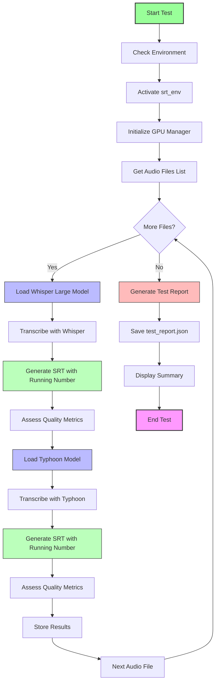
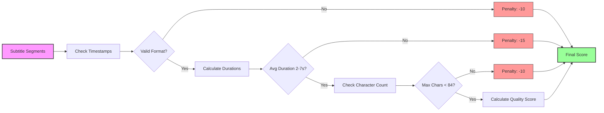
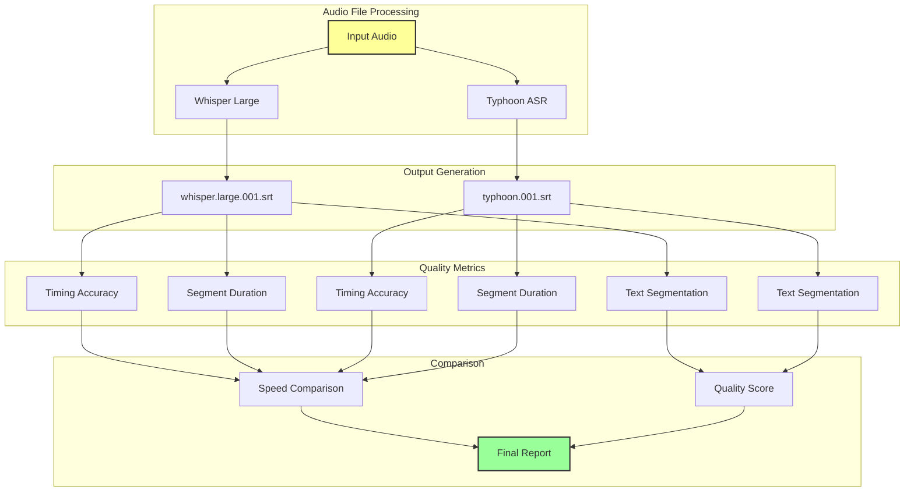

# MP3 to Subtitle Test Workflow Diagram

## Test Workflow Overview



## Quality Assessment Flow



## Model Comparison Process



## File Naming Convention

```mermaid
flowchart LR
    A[Audio File] --> B[Extract Basename]
    B --> C[Add Model Name]
    C --> D[Add Running Number]
    D --> E[Add .srt Extension]
    
    subgraph "Examples"
        F[Jasmali.MP3] --> G[Jasmali.whisper.large.001.srt]
        F --> H[Jasmali.typhoon.001.srt]
        I[ขนมครก.MP3] --> J[ขนมครก.whisper.large.001.srt]
        I --> K[ขนมครก.typhoon.001.srt]
    end
    
    style A fill:#ff9,stroke:#333,stroke-width:2px
    style E fill:#9f9,stroke:#333,stroke-width:2px
    style G fill:#bbf,stroke:#333,stroke-width:1px
    style H fill:#bbf,stroke:#333,stroke-width:1px
    style J fill:#bbf,stroke:#333,stroke-width:1px
    style K fill:#bbf,stroke:#333,stroke-width:1px